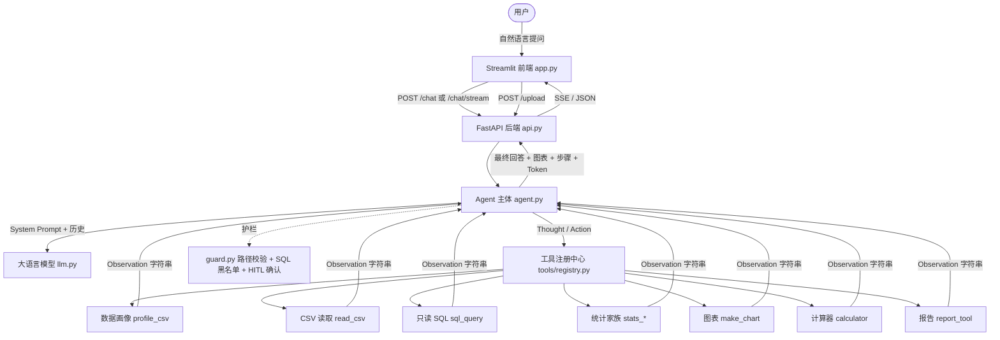
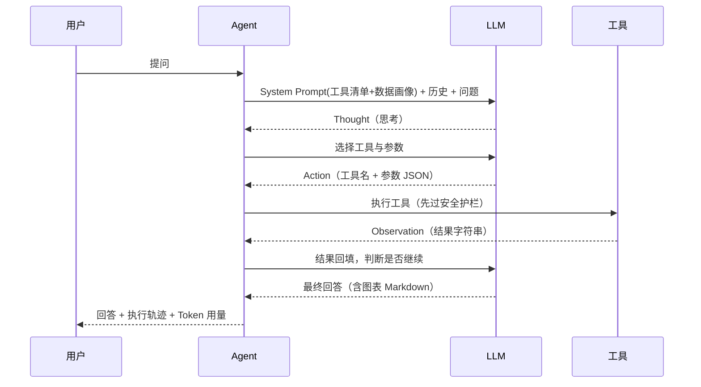

# AI Agent 智能任务编排平台 · 智能数据分析助手

> 上传一份 CSV，用中文口语提问，Agent 自主完成「理解意图 → 拆解任务 → 调用工具 → 反思迭代 → 输出报告」的完整闭环，
> 返回**数据表格 + 可视化图表 + 文字结论**，推理过程通过 **SSE 实时流式展示**。

    

---

## 目录

- [一、项目简介](#一项目简介)
- [二、核心功能](#二核心功能)
- [三、技术栈](#三技术栈)
- [四、5 分钟快速开始](#四5-分钟快速开始)
- [五、目录结构](#五目录结构)
- [六、系统架构](#六系统架构)
- [七、工具系统](#七工具系统)
- [八、安全护栏](#八安全护栏)
- [九、量化评估](#九量化评估)
- [十、部署说明](#十部署说明)
- [十一、工具扩展指南（新增一个工具 ≤ 30 分钟）](#十一工具扩展指南新增一个工具--30-分钟)
- [十二、常见问题 FAQ](#十二常见问题-faq)
- [十三、成果交付物对照](#十三成果交付物对照)

---

## 一、项目简介

传统 BI 工具是「人写 SQL → 工具出图」的被动应答模式；本项目把**分析过程的决策权交给 Agent**：

| | 传统问答式 BI | 本项目 Agent |
|---|---|---|
| 交互 | 需要写 SQL / 点选维度 | 自然语言提问，无需任何代码 |
| 规划 | 人拆解分析步骤 | Agent 自主决定调用哪些工具、按什么顺序 |
| 过程 | 黑盒出结果 | Thought → Action → Observation 全程可见（SSE 流式） |
| 纠错 | 报错即终止 | 工具报错后读取提示自我纠正（如列名错误 → 重试正确列名） |
| 产出 | 图表 | 表格 + 图表 + 结论 + Markdown 报告 |

**端到端示例**

```
用户：对比各地区销量，画一张柱状图，并说明哪个地区最需要提升
Agent：Thought  → 需要先按地区聚合销量
       Action   → stats_group_agg(group_by='region', column='quantity')
       Observation → 上海 83 / 北京 81 / 广州 54
       Action   → make_chart(chart_type='bar', x='region', y='quantity')
       Observation → 图表已保存: charts/chart_bar_region_a1b2c3d4.png
       最终回答 → 表格 + 内嵌图表 + 「广州销量最低，建议加大投放」结论
```

---

## 二、核心功能

| 编号 | 功能 | 实现位置 | 状态 |
|---|---|---|---|
| 1 | CSV 上传与自动解析入库（编码检测 / 列类型 / 缺失值） | `api.py::/upload`、`tools/profile_tool.py` | ✅ |
| 2 | 自然语言单步问答 + 多步复合分析 | `agent.py`（ReAct 循环） | ✅ |
| 3 | 11 个可插拔工具（CSV / SQL / 统计 / 图表 / 计算 / 报告） | `tools/` + `tools/registry.py` | ✅ |
| 4 | 多轮对话追问（"换成饼图""加上环比"） | `agent.py` 会话记忆 `_sessions` | ✅ |
| 5 | 安全护栏：危险 SQL 拦截、路径穿越防护、HITL 人工确认 | `tools/guard.py`、`tools/sql_tool.py`、`agent.py` | ✅ |
| 6 | 推理过程时间轴 + 图表结果 + Token 用量仪表盘 + SSE 流式 | `app.py`、`api.py::/chat/stream` | ✅ |
| 7 | 22 条测试任务集 + 六指标量化评估 + 消融对比 | `tests/tasks.json`、`eval.py` | ✅ |

---

## 三、技术栈

| 层级 | 选型 | 理由 |
|---|---|---|
| Agent 框架 | LangChain 1.x（`create_agent`，ReAct 范式） | 生态完整、工具抽象统一、便于教学与扩展 |
| LLM | 通义千问 / DeepSeek / GPT-4o（OpenAI 兼容接口） | 一个 `.env` 即可切换，中文场景成本低 |
| 后端 | FastAPI + Uvicorn | 原生异步、自带 Swagger、天然支持 SSE |
| 前端 | Streamlit | 组件完善，几百行即可做出可用界面 |
| 数据 | pandas + SQLite（CSV 自动入库） | 零配置、SQL 与 DataFrame 双通路 |
| 可视化 | Matplotlib（Agg 无窗口模式） | 服务端直接出 PNG，前端内嵌展示 |
| 评估 | 自研 `eval.py`（六指标 + LLM-as-Judge） | 指标口径完全对齐实习方案 |

---

## 四、5 分钟快速开始

### 4.1 环境要求

- Python **3.10+**（推荐 3.11），Windows / macOS / Linux 均可
- 一个可用的大模型 API Key（通义千问 / DeepSeek / OpenAI 任一）

### 4.2 安装

```bash
# 1) 克隆 / 解压项目后进入目录
cd ai-agent-data-analyst

# 2) 创建虚拟环境（Windows）
python -m venv .venv
.venv\Scripts\activate
# macOS / Linux：
# python3 -m venv .venv && source .venv/bin/activate

# 3) 安装依赖
pip install -r requirements.txt

# 4) 配置密钥
cp .env.example .env        # Windows: copy .env.example .env
#   编辑 .env，填入 OPENAI_API_KEY / OPENAI_BASE_URL / MODEL
```

`.env` 示例（通义千问）：

```ini
OPENAI_API_KEY=sk-你的密钥
OPENAI_BASE_URL=https://dashscope.aliyuncs.com/compatible-mode/v1
MODEL=qwen-plus
```

### 4.3 启动

```bash
# 终端 1：后端   http://localhost:8000/docs
uvicorn api:app --reload --port 8000

# 终端 2：前端   http://localhost:8501
streamlit run app.py
```

Windows 用户可直接双击：

- `scripts/start_backend.bat` —— 自动建虚拟环境、装依赖、起后端
- `scripts/start_frontend.bat` —— 起前端
- `scripts/start_all.bat` —— 一键同时启动前后端

首次启动后：点击左侧「使用示例数据 (demo.csv)」→ 在输入框提问，例如
**「按地区统计销量总和，并画一张柱状图」**。

> 打开侧边栏 **「SSE 流式输出」** 开关，即可实时看到 Agent 的
> 思考（Thought）→ 工具调用（Action）→ 观察结果（Observation）全过程。

### 4.4 自检

```bash
python -m tools.registry      # 打印已注册工具列表（应为 11 个）
python tests/test_tools.py    # 工具自测（不消耗 Token），应全部 PASS
python agent.py "各地区的销量总和是多少？"   # 命令行端到端跑一次真实 LLM
```

---

## 五、目录结构

```
ai-agent-data-analyst/
├── README.md                  # 本文件（项目说明 + 部署说明 + 工具扩展指南）
├── requirements.txt           # 依赖清单
├── .env.example               # 环境变量示例（复制为 .env 后填密钥）
├── .gitignore                 # 忽略密钥与运行产物
├── Dockerfile / docker-compose.yml   # 容器化部署
│
├── agent.py                   # Agent 主体：Prompt 组装 / ReAct 循环 / SSE 事件 / HITL
├── api.py                     # FastAPI 后端：7 个 REST 接口 + SSE 流式接口
├── app.py                     # Streamlit 前端：对话 / 推理时间轴 / 图表 / Token 仪表盘
├── llm.py                     # 模型初始化（.env 切换 provider / model）
├── eval.py                    # 量化评估脚本（六指标 + 消融对比）
├── demo.csv                   # 示例数据（15 行销售数据，含缺失值）
│
├── tools/                     # 工具系统（新增工具只在这里加文件）
│   ├── registry.py            # 注册中心：自动发现 tools/ 下所有 @tool
│   ├── guard.py               # 共享安全护栏（路径校验）
│   ├── profile_tool.py        # ① 数据画像：编码 / 类型 / 缺失值 / 基数
│   ├── csv_tool.py            # ② CSV 读取预览
│   ├── sql_tool.py            # ③ 只读 SQL 查询（SQLite）
│   ├── stats_tool.py          # ④ 统计：描述 / 计数 / 分组 / 环比 / 同比
│   ├── chart_tool.py          # ⑤ 图表：折线 / 柱状 / 散点 / 直方 / 饼图
│   ├── calculator_tool.py     # ⑥ 安全计算器
│   ├── report_tool.py         # ⑦ Markdown 报告生成
│   └── _template.py           # 新工具模板（下划线开头，不被注册）
│
├── tests/
│   ├── tasks.json             # 22 条标准测试任务集
│   └── test_tools.py          # 工具自测脚本（无需 LLM）
│
├── scripts/                   # 一键启动脚本（Windows bat + Linux sh）
├── docs/                      # 文档：架构 / 工具 / API / 部署 / 评估 / 交付清单
├── charts/                    # 生成的图表 PNG（运行产物）
├── reports/                   # 生成的 Markdown 报告（运行产物）
├── uploads/                   # 上传的 CSV（运行产物）
└── data/                      # SQLite 数据库（CSV 自动入库）
```

---

## 六、系统架构



**ReAct 单次循环**（`agent.py::iter_react_events`）



**三层记忆**

| 类型 | 实现 | 内容 | 生命周期 |
|---|---|---|---|
| 短期记忆 | `agent.py::_sessions` 按 session_id 分桶 | 当前会话的多轮对话历史 | 单次会话 |
| 工作记忆 | 每轮动态注入 System Prompt | 当前数据文件路径 + 数据画像 | 单轮任务 |
| 长期记忆 | 预留接口（Chroma / Redis） | 用户偏好、历史结论 | 跨会话（生产环境） |

> 生产建议：把 `_sessions` 换成 Redis、把画像缓存换成向量库，即可实现跨会话长期记忆。

---

## 七、工具系统

工具由 `tools/registry.py` **自动发现**，当前共 **11 个**：

| 工具 | 功能 | 关键参数 | 何时用 / 何时不用 |
|---|---|---|---|
| `profile_csv` | 数据画像（编码/类型/缺失/基数） | `csv_path` | 首次了解数据用；已知列名时不用 |
| `read_csv` | 预览前 N 行 | `file_path`, `nrows` | 只需看样例时用；需聚合时不用 |
| `sql_query` | 只读 SQL 查询（SQLite） | `csv_path`, `sql` | 多条件筛选/排序/复杂聚合时用 |
| `stats_summary` | 数值列描述统计 | `csv_path` | 求 mean/min/max/std 时用 |
| `stats_value_counts` | 某列取值计数 | `csv_path`, `column` | 数出现次数时用 |
| `stats_group_agg` | 分组求和与均值 | `csv_path`, `group_by`, `column` | 按地区/产品分组统计时用 |
| `stats_mom` | 环比增长率 % | `csv_path`, `date_col`, `value_col` | 逐期对比时用 |
| `stats_yoy` | 同比增长率 % | `csv_path`, `date_col`, `value_col` | 年度对比时用 |
| `make_chart` | 图表生成（5 类 PNG） | `csv_path`, `chart_type`, `x`, `y` | 需要可视化时用；只问数字不用 |
| `calculator` | 安全算术计算 | `expression` | 纯算术用；不做数据聚合 |
| `report_tool` | 生成 Markdown 报告 | `markdown_body`, `title` | 用户明确要「报告」时用 |

- 完整 JSON Schema 见 [`docs/tools_schema.json`](docs/tools_schema.json) 与 [`docs/02_工具文档.md`](docs/02_工具文档.md)
- 在线查看：`GET /tools` 或 http://localhost:8000/docs

**设计要点**：统计能力被拆成 5 个独立工具而不是「一个函数 + operation 参数」——
让模型**选工具**比让模型**填参数**更不容易出错，工具调用准确率显著提升。

---

## 八、安全护栏

| 护栏 | 机制 | 位置 |
|---|---|---|
| 危险 SQL 拦截 | 正则硬拦截 DROP/DELETE/UPDATE/INSERT/ALTER/CREATE/TRUNCATE/ATTACH/PRAGMA/VACUUM；仅放行 `SELECT` 开头 | `tools/sql_tool.py` |
| 只读执行 | SQLite 以 `mode=ro` 只读连接执行用户 SQL（双保险） | `tools/sql_tool.py` |
| 路径穿越防护 | 禁止绝对路径（含 POSIX 风格 `/xxx`）、禁止 `..`、可限定基目录 | `tools/guard.py` |
| 代码注入防护 | 计算器字符白名单（禁字母）+ 清空内置环境 + 禁嵌套乘方 + 长度上限 | `tools/calculator_tool.py` |
| 图表类型白名单 | 仅 `line/bar/scatter/hist/pie`，列名存在性校验 | `tools/chart_tool.py` |
| HITL 人工确认 | 命中「删除意图 + 文件对象」时暂停，前端二次确认后执行 | `agent.py` + `POST /confirm` |
| 异常兜底 | 工具异常返回「人话」而非崩溃；后端统一捕获异常返回 JSON | 各工具 + `api.py` |

护栏压力测试用例已包含在 `tests/tasks.json`（第 19–22 条：缺失值、不存在的列、删除文件、DROP TABLE）。

---

## 九、量化评估

```bash
python eval.py                 # 基线 + 两组消融（默认 8 线程并发）
python eval.py --judge         # 额外启用 LLM-as-Judge 评估轨迹合理性
python eval.py --baseline-only # 只跑基线（省钱）
python eval.py --workers 1     # 串行跑（响应时长指标准确）
```

**六指标口径**（对齐实习方案「Agent 评估核心指标速查表」）

| 指标 | 计算方式 | 优化方向 |
|---|---|---|
| 任务完成率 | 成功任务数 / 总任务数（关键词命中 + 无异常） | 优化 Prompt、工具描述 |
| 工具调用准确率 | 期望工具被实际调用到的比例 | 优化工具描述与 Schema |
| 平均执行步数 | 完成任务的工具调用次数均值（越少越好） | 优化规划策略 |
| 单任务 Token 成本 | 单任务 prompt + completion Token 均值 | 上下文压缩、记忆优化 |
| 平均响应时长 | 端到端耗时（串行跑才准确） | 异步调用、工具并发 |
| 轨迹合理性 | LLM-as-Judge 1–5 分（未启用时用步数区间启发式） | 改进 ReAct Prompt |

**产出文件**

- `tests/eval_results.csv` —— 逐条任务结果（成功/步数/工具/Token/延迟/Judge）
- `tests/eval_metrics.csv` —— 各变体六指标汇总
- `tests/eval_ablation.png` —— 消融对比柱状图

**内置消融变体**（`eval.py::VARIANTS`）：`baseline` / `prompt_opt`（Thought 引导 + Few-shot）/ `tool_desc`（工具描述补「何时用/何时不用」）。

---

## 十、部署说明

### 10.1 本地部署（推荐演示用）

见 [第四节 5 分钟快速开始](#四5-分钟快速开始)。Windows 用 `scripts/*.bat`，macOS/Linux 用 `bash scripts/start.sh all`。

### 10.2 服务器 / 云端部署

```bash
# 后端（--workers 按 CPU 核数调整；会话状态在内存，多进程时请保持 1 worker 或改 Redis）
nohup uvicorn api:app --host 0.0.0.0 --port 8000 > logs/backend.log 2>&1 &

# 前端（API_URL 指向后端可达地址）
API_URL=http://<服务器IP>:8000 nohup streamlit run app.py \
  --server.port 8501 --server.address 0.0.0.0 > logs/frontend.log 2>&1 &
```

生产建议：用 systemd / supervisor 托管进程，Nginx 反向代理 + HTTPS，防火墙只放行 80/443。

### 10.3 Docker 部署

```bash
cp .env.example .env      # 填入密钥
docker compose up -d --build
# 前端 http://localhost:8501   后端 http://localhost:8000/docs
```

### 10.4 云平台（Cloud Studio / 腾讯云 / 云服务器）

1. 上传整个项目目录（**不要**上传 `.env`、`.venv`、`__pycache__`）
2. 安装依赖：`pip install -r requirements.txt`
3. 在平台环境变量中配置 `OPENAI_API_KEY / OPENAI_BASE_URL / MODEL / API_URL`
4. 启动命令：`uvicorn api:app --host 0.0.0.0 --port 8000` 与
   `streamlit run app.py --server.port 8501 --server.address 0.0.0.0`
5. 开放端口 8000 / 8501（前端 `API_URL` 必须填后端**公网可达**地址，不能是 localhost）

> 云端容器若无中文字体，图表中文会显示成方块：Linux 执行 `apt-get install -y fonts-wqy-zenhei`（Dockerfile 已内置）。

完整部署细节见 [`docs/04_部署说明.md`](docs/04_部署说明.md)。

---

## 十一、工具扩展指南（新增一个工具 ≤ 30 分钟）

系统设计目标：**新增工具不需要改动 `agent.py` / `api.py` / `app.py` 任何一行**。
注册中心 `tools/registry.py` 会在启动时扫描 `tools/` 目录，自动发现所有 `@tool` 装饰的函数，
自动生成 JSON Schema、自动写进 System Prompt 的工具清单、自动出现在 `GET /tools` 与前端工具箱。

### 四步接入

**① 复制模板（1 分钟）**

```bash
cp tools/_template.py tools/my_tool.py     # 注意：文件名不要以 _ 开头
```

**② 改写函数（15 分钟）**

```python
from langchain_core.tools import tool
from .guard import safe_path

RISK_LEVEL = "low"          # 可选：low / medium / high（high 会被 HITL 重点关注）

@tool
def top_n(csv_path: str, column: str, n: int = 3) -> str:
    """取某一列数值最大的前 N 条记录。
    适合"找出销量最高的 3 个品类"这类问题；需要按某列分组求和时请用 stats_group_agg。"""
    try:
        safe_path(csv_path)                       # ① 先过路径护栏
    except ValueError as e:
        return f"错误：{e}"
    try:
        import pandas as pd
        df = pd.read_csv(csv_path)
        if column not in df.columns:              # ② 列名校验要给出可用列，方便模型自我纠正
            return f"错误：列不存在，可用列 {list(df.columns)}"
        return df.nlargest(n, column).to_string(index=False)
    except Exception as e:
        return f"错误：{type(e).__name__}: {e}"   # ③ 出错返回人话，不要抛异常
```

三条铁律：
- **必须写参数类型注解**（`csv_path: str`）——模型靠它填参数
- **必须写 docstring**——模型靠它决定「何时用 / 何时不用」，建议明确写出不用场景
- **必须返回字符串**——工具结果要塞进对话消息，返回 DataFrame/图片对象会导致接口 400

**③ 重启后端并验证（2 分钟）**

```bash
uvicorn api:app --reload --port 8000
python -m tools.registry        # 新工具应出现在列表中
curl http://localhost:8000/tools
```

**④ 补测（5 分钟）**

在 `tests/test_tools.py` 中加一条用例：

```python
run_case("TopN 取前 3", lambda: top_n.invoke({"csv_path": CSV, "column": "quantity", "n": 3}), "北京")
```

### 进阶

- **控制工具在 Prompt 中的顺序**：把函数名加入 `tools/registry.py::TOOL_ORDER`
- **标记高风险工具**：模块内声明 `RISK_LEVEL = "high"`，`GET /tools` 会带 `risk` 字段
- **需要外部凭据的工具**（如搜索 API Key）：在 `llm.py` 同层级读取 `.env`，不要把密钥写进代码

完整扩展规范与踩坑清单见 [`docs/03_工具扩展指南.md`](docs/03_工具扩展指南.md)。

---

## 十二、常见问题 FAQ

**Q1：启动时报 `ModuleNotFoundError: No module named 'xxx'`？**
没激活虚拟环境或依赖没装全：`.venv\Scripts\activate` 后重试 `pip install -r requirements.txt`。

**Q2：前端提示「后端离线」？**
后端没起来或端口不一致。确认 `uvicorn api:app --port 8000` 已运行；云端部署时前端需设置 `API_URL` 环境变量。

**Q3：上传文件接口报 400 / 422？**
缺少 `python-multipart` 依赖，执行 `pip install python-multipart`。

**Q4：图表中文显示成方块？**
服务器缺中文字体。Linux：`apt-get install -y fonts-wqy-zenhei`；Windows/macOS 一般自带。

**Q5：Agent 回答「尚未加载数据文件」？**
点击左侧「使用示例数据 (demo.csv)」或先上传 CSV——系统不会默认加载任何文件。

**Q6：Token 消耗偏高？**
工具会自动注入数据画像，长对话时可精简 System Prompt、或在 `agent.py` 中降低历史轮数（生产环境建议做上下文压缩）。

**Q7：会话历史重启后丢失？**
`_sessions` 是内存字典。生产环境请替换为 Redis 或数据库持久化。

**Q8：如何切换模型？**
修改 `.env` 的 `MODEL` / `OPENAI_BASE_URL` / `OPENAI_API_KEY` 后重启即可（见 `.env.example` 三段示例）。

---

## 十三、成果交付物对照

对应实习方案「七、成果交付物清单」：

| 交付物 | 本项目位置 | 状态 |
|---|---|---|
| ① 完整项目源码 + README（含部署说明、工具扩展指南） | 本仓库全部文件 + 本 README | ✅ |
| ② 可运行的 Web 平台（本地或云端） | `uvicorn api:app` + `streamlit run app.py`（含 Docker 部署） | ✅ |
| ③ 技术报告（≥15 页，含架构图/评估/消融） | `docs/技术报告_AI_Agent智能数据分析平台.pdf` | ✅ |
| ④ 评估数据（≥20 条任务集 + 评估脚本 + 结果 CSV） | `tests/tasks.json`（22 条）、`eval.py`、`tests/eval_*.csv` | ✅ |
| ⑤ 演示视频（3–5 分钟） | 需自行录制：建议流程见 `docs/07_交付清单.md` | ⏳ |
| ⑥ 答辩 PPT（≤20 页） | 需按 `docs/` 内容制作，结构与素材已备齐 | ⏳ |
| ⑦ 工具文档（JSON Schema + 使用说明） | `docs/tools_schema.json`、`docs/02_工具文档.md` | ✅ |

---

## 附录：常用命令速查

```bash
python -m tools.registry      # 查看已注册工具
python tests/test_tools.py    # 工具自测（不消耗 Token）
python agent.py "你的问题"     # 命令行端到端对话
python eval.py --baseline-only # 只跑基线评估
uvicorn api:app --reload --port 8000   # 起后端
streamlit run app.py                    # 起前端
```

## 许可

[MIT License](LICENSE) —— 课程作业 / 学习用途可自由使用与二次开发。
