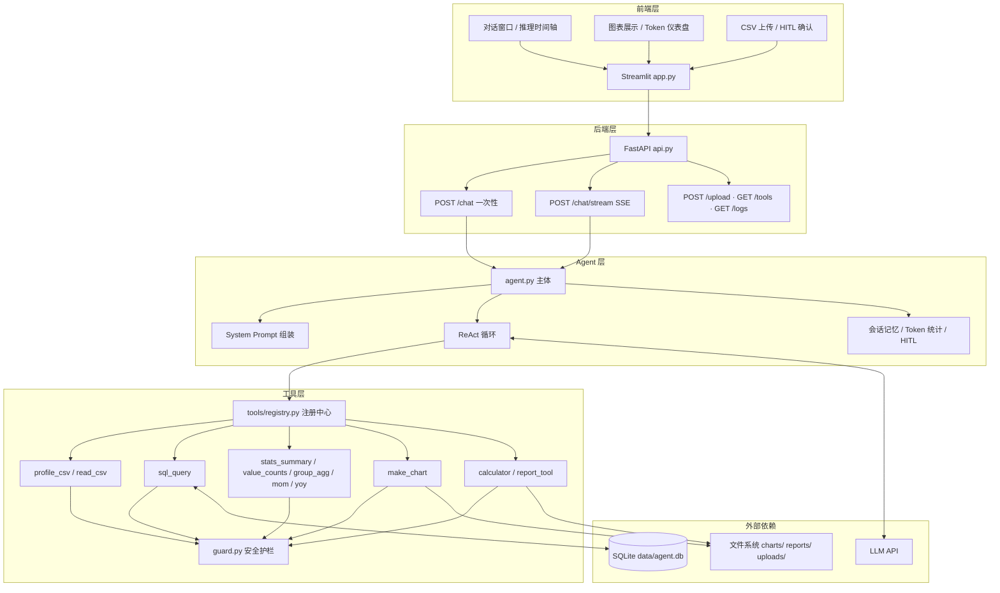
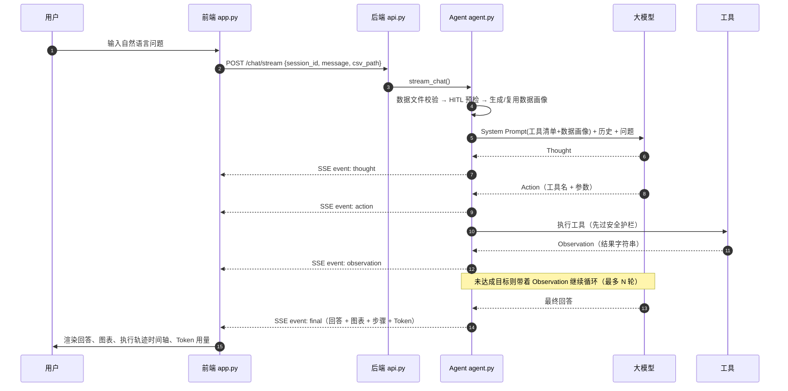

# 01 · 系统架构设计

## 1. 总体架构



## 2. 核心执行流程（ReAct）



## 3. 模块职责

| 模块 | 职责 | 关键函数 / 类 |
|---|---|---|
| `agent.py` | Prompt 组装、ReAct 循环、SSE 事件、HITL、日志 | `build_system_text` `invoke_once` `iter_react_events` `chat` `stream_chat` |
| `api.py` | REST 接口、SSE 推送、静态资源、异常兜底 | `/chat` `/chat/stream` `/upload` `/tools` `/logs` `/confirm` |
| `app.py` | 会话管理、对话渲染、推理时间轴、图表、Token 仪表盘 | `process_pending` `_stream_render` `render_timeline` |
| `llm.py` | 模型初始化（provider / model / 温度可配） | `llm` |
| `tools/registry.py` | 工具自动发现、排序、Schema 生成 | `discover_tools` `catalog` `prompt_catalog` |
| `tools/guard.py` | 路径安全护栏 | `safe_path` |
| `eval.py` | 六指标评估与消融对比 | `run_variant` `judge_trajectory` `plot_ablation` |

## 4. 记忆机制

| 类型 | 存储位置 | 内容 | 生命周期 | 生产建议 |
|---|---|---|---|---|
| 短期记忆 | `agent.py::_sessions`（内存字典，按 session_id 分桶） | 多轮对话历史（user/ai/tool 消息） | 单次会话 | 换 Redis |
| 工作记忆 | 每轮动态注入的 System Prompt | 当前数据文件路径 + 数据画像 | 单轮任务 | 保持 |
| 长期记忆 | 预留（Chroma / 向量库） | 用户偏好、历史结论 | 跨会话 | 接入 Chroma 后按相似度召回注入 |

**上下文成本控制**：数据画像按「文件是否变化」缓存（`_profiles`），同一文件不重复调用 `profile_csv`；
System Prompt 每轮动态注入而非写入历史，避免历史中堆积重复的 system 消息。

## 5. 安全护栏分层

```mermaid
flowchart LR
    A[用户输入] --> B[HITL 意图预检\n删除+文件 → 暂停确认]
    B --> C[System Prompt 约束\n禁止编造 / 只允许清单内工具]
    C --> D[工具层护栏\n路径校验 · SQL 黑名单 · 字符白名单 · 类型白名单]
    D --> E[执行层兜底\n异常返回人话 · 后端统一捕获返回 JSON]
    E --> F[日志可追溯\nGET /logs/{session_id}]
```

## 6. 为什么不选 Function Calling / Plan-and-Execute

| 维度 | 本系统（ReAct） | Function Calling | 说明 |
|---|---|---|---|
| 灵活性 | 高 | 中 | 分析需求开放，ReAct 可应对未知任务 |
| 可控性 | 中 | 高 | 通过工具白名单 + 护栏补齐可控性 |
| Token 成本 | 中高 | 低 | 多轮推理累积上下文，靠画像缓存与历史裁剪控制 |
| 适用场景 | 探索性数据分析 | 流程固定的业务操作 | 本项目属于探索性分析 |

> 说明：本版本聚焦 **ReAct + SSE 流式可视化**，不引入 Plan-and-Execute 多智能体编排，
> 以保证链路简洁、可解释、易演示。多步任务由 ReAct 循环内的自主工具串联完成。

## 7. 可扩展性设计

- **工具扩展**：`tools/` 下新增 `@tool` 函数即可自动注册（详见 `03_工具扩展指南.md`）
- **模型扩展**：`.env` 切换 provider / model（`llm.py`）
- **存储扩展**：`_sessions` → Redis；`data/agent.db` → PostgreSQL / DuckDB
- **前端扩展**：`app.py` 为单文件 Streamlit，可独立替换为 React / Vue（后端接口不变）
